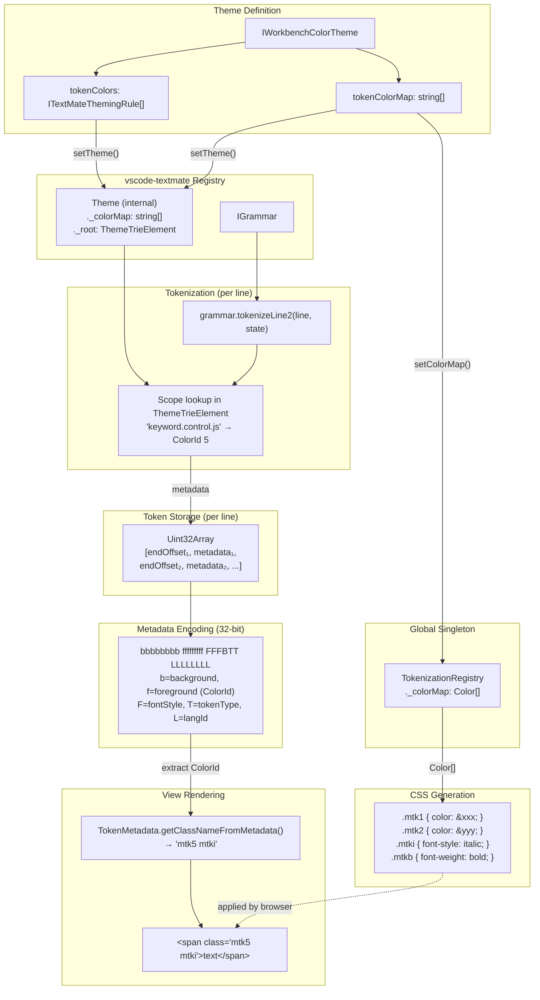
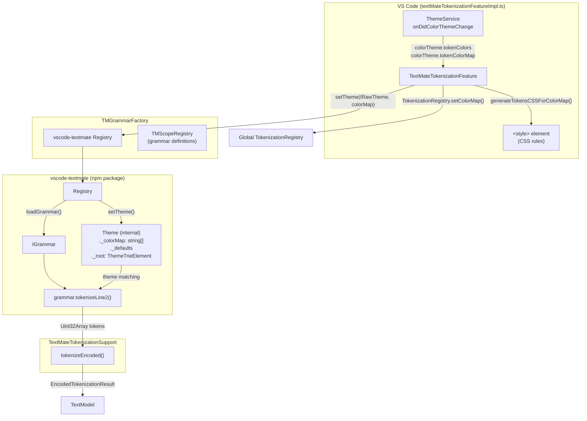

# Tokenization Architecture

## Overview

Monaco Editor's tokenization system converts source code into styled tokens. The architecture uses a **global color map** which is why a single TextModel cannot be displayed with different themes in different editors simultaneously.

## Data Flow Diagram (Simplified)




## Token Metadata Encoding

Each token is stored as two 32-bit integers in a `Uint32Array`:
1. **End offset** of the token
2. **Metadata** (packed 32-bit value)

### Metadata Binary Format

```
     3322 2222 2222 1111 1111 1100 0000 0000
     1098 7654 3210 9876 5432 1098 7654 3210
     bbbb bbbb ffff ffff fFFF FBTT LLLL LLLL
```

| Field | Bits | Description |
|-------|------|-------------|
| **LanguageId (L)** | 8 bits (0-7) | Language identifier |
| **TokenType (T)** | 2 bits (8-9) | Comment/String/RegEx/Other |
| **BalancedBrackets (B)** | 1 bit (10) | Contains balanced brackets |
| **FontStyle (F)** | 4 bits (11-14) | Italic/Bold/Underline/Strikethrough |
| **Foreground (f)** | 9 bits (15-23) | ColorId index into color map |
| **Background (b)** | 8 bits (24-31) | ColorId (not rendered in DOM) |

## TextMate Tokenization Deep Dive

The TextMate tokenizer is how VS Code tokenizes most languages. Here's the detailed data flow:

### Architecture



### Theme Flow

1. **Theme Change Event**: `ThemeService.onDidColorThemeChange` fires
2. **`_updateTheme()` in TextMateTokenizationFeatureImpl**:
   ```typescript
   this._grammarFactory?.setTheme(this._currentTheme, this._currentTokenColorMap);
   TokenizationRegistry.setColorMap(colorMap);
   ```
3. **TMGrammarFactory.setTheme()** delegates to vscode-textmate:
   ```typescript
   this._grammarRegistry.setTheme(theme, colorMap);
   ```
4. **vscode-textmate Registry** creates internal `Theme` object with:
   - `_colorMap: string[]` - Array of color hex strings
   - `_root: ThemeTrieElement` - Trie for scope → style lookup

### Tokenization Flow

1. **TextMateTokenizationSupport.tokenizeEncoded()** is called per line
2. Calls **`grammar.tokenizeLine2(line, state, timeLimit)`** (vscode-textmate)
3. vscode-textmate **internally**:
   - Runs grammar rules to find token scopes (e.g., `keyword.control.js`)
   - Looks up each scope in its internal `ThemeTrieElement`
   - Packs result into 32-bit metadata with ColorId from its `_colorMap`
4. Returns `ITokenizeLineResult2` with `tokens: Uint32Array`

### Critical Insight: Theme Lives in vscode-textmate

The **ThemeTrieElement** that maps scopes to colors is **inside vscode-textmate**, not exposed to VS Code. When you call `Registry.setTheme()`:

```typescript
// vscode-textmate internally does:
this._theme = Theme.createFromRawTheme(theme, colorMap);
// Theme stores: _colorMap, _defaults, _root (ThemeTrieElement)
```

This means:
- **One Registry = One Theme** at a time
- All grammars from that Registry use the same theme
- Token metadata contains ColorIds relative to that theme's color map

### Key Files (TextMate Tokenization)

- `src/vs/workbench/services/textMate/browser/textMateTokenizationFeatureImpl.ts` - Main orchestrator
- `src/vs/workbench/services/textMate/common/TMGrammarFactory.ts` - Wraps vscode-textmate Registry
- `src/vs/workbench/services/textMate/browser/tokenizationSupport/textMateTokenizationSupport.ts` - ITokenizationSupport implementation
- `node_modules/vscode-textmate/` - The actual tokenization engine

### Other Key Files

- `src/vs/editor/common/encodedTokenAttributes.ts` - Metadata encoding/decoding
- `src/vs/editor/common/tokens/lineTokens.ts` - LineTokens class
- `src/vs/editor/common/languages/supports/tokenization.ts` - TokenTheme, ColorMap, CSS generation
- `src/vs/editor/common/tokenizationRegistry.ts` - Global TokenizationRegistry
- `src/vs/editor/common/viewLayout/viewLineRenderer.ts` - Renders tokens to HTML

## Why Single Theme Per Model

The **ColorId** (e.g., `5`) stored in token metadata is an index into a **single global ColorMap**. When CSS rule `.mtk5 { color: #abc; }` is generated globally, all editors display that same color.

### To Support Multiple Themes Per Editor

Options would include:
1. **Per-editor scoped CSS** - Prefix classes with unique editor IDs
2. **Inline styles** - Use `TokenMetadata.getInlineStyleFromMetadata()` instead of class names
3. **Re-tokenize per theme** - Maintain separate token storage per theme (expensive)

## Background Colors

Token background colors are **not rendered** in the DOM renderer:
- The schema marks `background` as deprecated
- `generateTokensCSSForColorMap()` only generates foreground color rules
- `getClassNameFromMetadata()` only extracts foreground and font style

The background bits exist for compatibility with TextMate grammar format but are ignored at render time (except in GPU renderer for subpixel anti-aliasing calculations).
